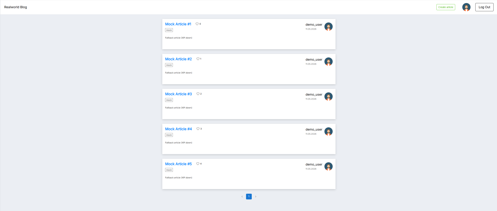

# Blog Platform

Frontend application for reading, creating, and managing blog posts.

## Features
- User authentication
- Creating and editing posts
- Responsive layout
- Routing
- Form validation
- API integration
- State management
- Loading states
- Error handling
- Empty states

## Tech Stack
- React
- TypeScript
- Redux Toolkit
- React Router
- Axios
- SCSS Modules
- Vite

## Demo
Live Demo: https://blog-platform-psi-three.vercel.app/

## Screenshots

### Desktop


### Mobile


## Installation

```bash
npm install
npm run dev
```

## Author
Kseniia Suvorova
